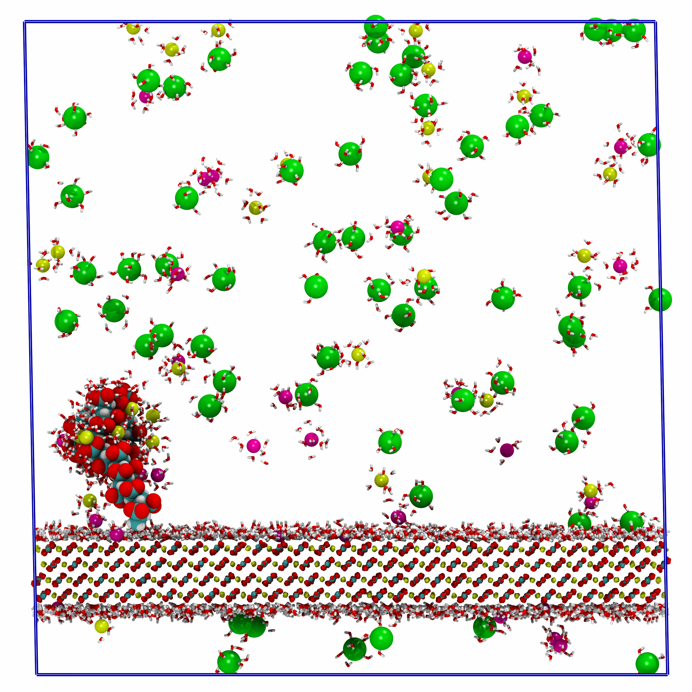

# Surface Data Analysis Repository

**Project Description:** Data analysis scripts and notebooks for interfacial polyelectrolyte molecular dynamics simulations using Gromacs.
**Authors:** [Alec Glisman](https://github.com/alec-glisman)
**Technologies Used:** Python, Gromacs, Jupyter, Sphinx, Pytorch, Scikit-learn, RDKit

[](https://github.com/alec-glisman/Analysis-Polyelectrolyte-Surface-Adsorption/actions/workflows/conda-pytest.yml)
[](https://github.com/alec-glisman/Analysis-Polyelectrolyte-Surface-Adsorption/actions/workflows/code-linting.yml)
[](https://github.com/alec-glisman/Analysis-Polyelectrolyte-Surface-Adsorption/actions/workflows/close-stale-issues-pr.yml)
[](https://wakatime.com/badge/user/0415a834-884a-4442-8748-eadcc49ca5e1/project/1fbd0bd3-15bf-4f97-ba55-8cf29e0496ce)



## Repository Structure

- `.github`: GitHub Actions workflows for continuous integration as well as issue and pull request templates.
- `.vscode`: Settings for the [Visual Studio Code](https://code.visualstudio.com/) editor.
- `analysis`: Data analysis scripts and notebooks.
- `ddpm`: Scripts for training and evaluating denoising diffusion probabilistic models.
- `docs`: Documentation source files for Python code in the `src` directory.
- `images`: Images used in the documentation.
- `requirements`: Conda environment files for development and production.
- `src`: Python source code and unit tests.

## Installation

The recommended way to install this project is using [conda](https://docs.conda.io/en/latest/).
The `requirements` directory contains environment files for development and production.
To create a conda environment for development, run the following command from the root directory of the repository:

```bash
conda env create -f requirements/analysis.yml
```

The analysis environment includes the dependencies needed to run the analysis scripts and notebooks.
The ml environment includes all the dependencies needed to run the denoising diffusion probabilistic model scripts.

## Usage

Source code for the data analysis scripts and notebooks is located in the `src` directory.
The `analysis` directory contains the scripts and notebooks themselves that use the source code.
The `ddpm` directory contains scripts for training and evaluating denoising diffusion probabilistic models.
The `docs` directory contains the source files for the documentation.
The `requirements` directory contains environment files for development and production.

## Documentation

The documentation is built using [sphinx](https://www.sphinx-doc.org/en/master/).
For information on how to build the documentation, see the [documentation README](docs/README.md).
Contributions to improve the documentation are welcome.
Our current documentation focuses on the signature of each function and class and does not include any tutorials or examples.

## Contributing

When contributing to this repository, please first open an issue on GitHub to discuss the change you wish to make.
We have provided issue templates for bug reports and feature requests.
If you would like to contribute code, please follow the [PEP8](https://www.python.org/dev/peps/pep-0008/) style guide.
We use [flake8](http://flake8.pycqa.org/en/latest/) to check for PEP8 compliance and [black](https://github.com/psf/black) to format the code.
[Pre-commit](https://pre-commit.com/) is used to run these checks before each commit as well as to rebuild the documentation using [sphinx](https://www.sphinx-doc.org/en/master/).
We also strongly recommend adding unit tests for any new code using [pytest](https://docs.pytest.org/en/latest/).

### Pull Request Process

1. Create a branch with a descriptive name for the feature or bug fix.
2. Make your changes and commit them.
3. Push your changes to the branch.
4. Open a pull request on GitHub.
5. The pull request will be reviewed and merged into the main branch if approved and all checks pass.

## License

This project is licensed under the MIT License - see the [LICENSE](LICENSE) file for details.
